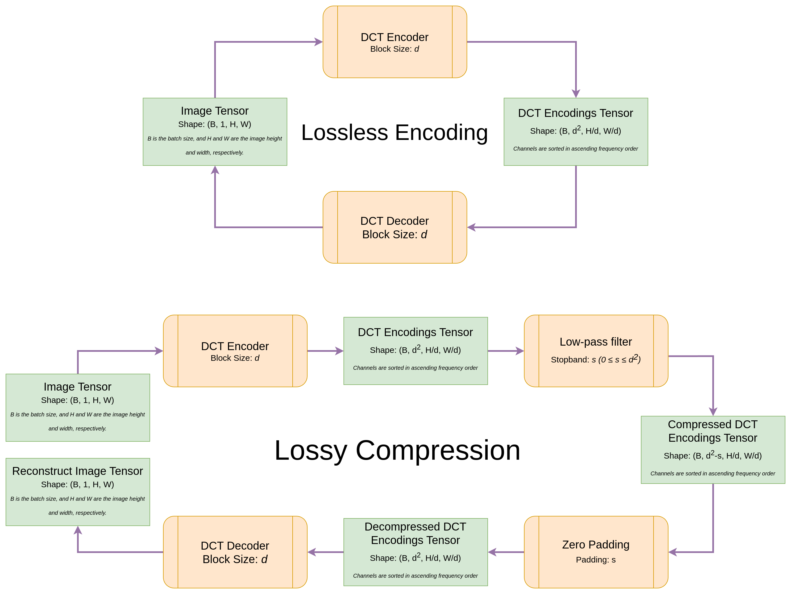
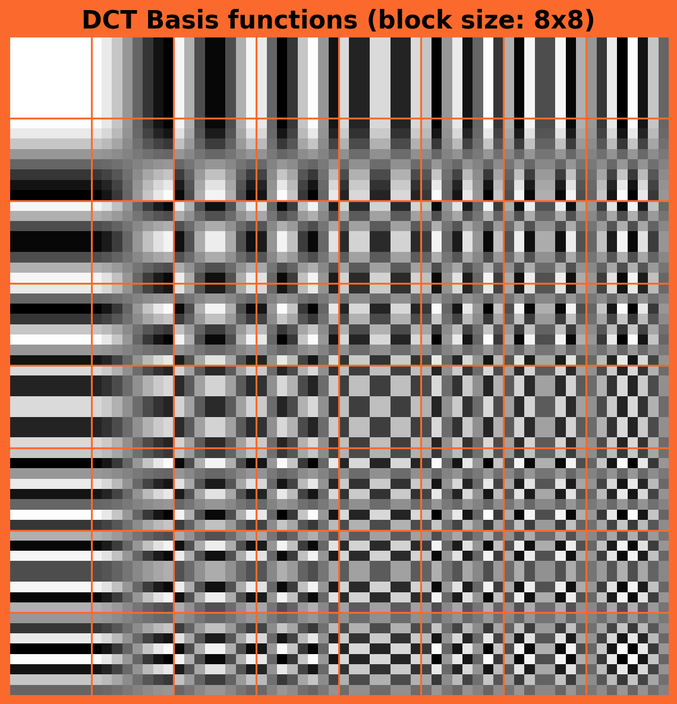
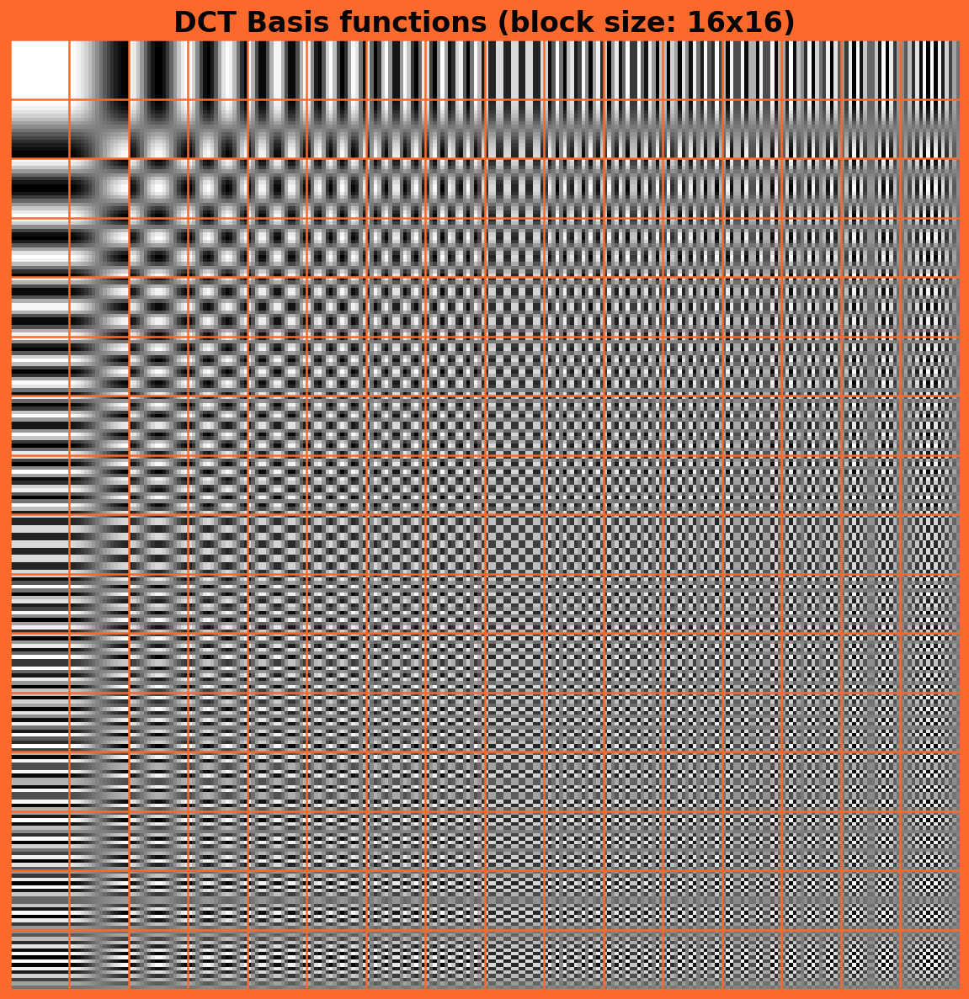
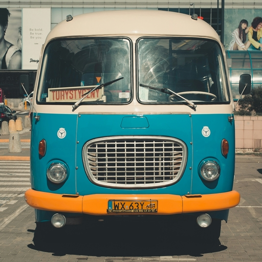
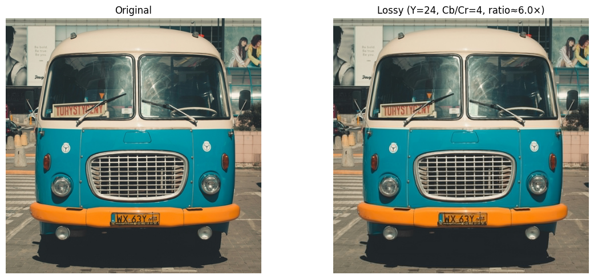

+++
date = '2026-06-06T14:14:03+03:30'
draft = false
title = 'JPEG Compression as a Differentiable PyTorch Module'
description = 'Building a DCT autoencoder from the same math that powers JPEG'
tags = ['computer-vision', 'signal-processing', 'pytorch']
math = true
+++

Most autoencoders learn their representations from data. That's powerful, but opaque —
you can't easily reason about what each latent dimension means, or guarantee invertibility.

JPEG takes the opposite approach. Its encoding is a fixed, well-understood
signal-processing pipeline. I've always found that contrast interesting, so I built
[`dct-autoencoder`](https://github.com/dariush-bahrami/dct-autoencoder) — a PyTorch
module that implements the core JPEG pipeline analytically, without any training.

---

## The motivation

A question I kept running into doing computer vision work: why do we process images in
RGB?

For tasks like classification, segmentation, or detection, spatial resolution matters a
lot. Show a human a 64×64 image and ask them to classify it — it's genuinely hard.
Show them a 512×512 image with heavy JPEG compression artifacts and they get it
immediately. The structure is there, the fine color detail is not, and that's fine.

RGB doesn't reflect this. A 512×512×3 tensor treats every pixel's red, green, and blue
values as equally important. But a lot of that color information — especially in high
frequencies — is not what the model needs.

My bet with this package: **we can process high-resolution images with much lower compute
by working in the frequency domain instead.**

A 512×512 RGB image encoded with block size 8, keeping 24 luminance and 4 chrominance
channels per block, becomes a 64×64×32 tensor. That's the same scene, but
**6× fewer values** to process. The spatial structure is preserved. The perceptually
irrelevant high-frequency color detail is dropped. And 32 channels is well within the
range of standard CNN input stages — many architectures stack extra channels on top of
RGB anyway.

This is the same trade-off JPEG has exploited for decades. The difference is that here
it's a differentiable PyTorch module, so gradients flow through it.

---

## The pipeline

The full encode → compress → decompress → decode flow mirrors JPEG's core structure:



1. **RGB → YCbCr** — separate luminance (brightness) from chrominance (colour)
2. **Block DCT** — split each channel into non-overlapping $N \times N$ blocks and apply the 2-D Type-II DCT via strided convolution
3. **Optional compression** — zero out high-frequency coefficients
4. **Inverse path** — pad zeros back in, apply IDCT, convert YCbCr → RGB

Encoding is lossless by default. Compression is opt-in.

---

## The math

### Why YCbCr?

RGB channels are highly correlated. The human visual system is far more sensitive to
brightness than to hue, so JPEG first separates the two:

- **Y** — luminance (perceived brightness)
- **Cb** — blue-difference chrominance
- **Cr** — red-difference chrominance

The forward transform:

$$
Y  = 0.299\,R + 0.587\,G + 0.114\,B
$$

$$
C_b = (B - Y) \cdot 0.564 + 0.5,\quad
C_r = (R - Y) \cdot 0.713 + 0.5
$$

The 0.5 offset keeps values in $[0, 1]$ when the input is in $[0, 1]$. The inverse uses
the exact matrix inverse, so the round-trip is numerically exact within floating-point
precision.

### The 2-D DCT

For an $N \times N$ block, the Type-II 2-D DCT maps pixel values $f(x, y)$ to
coefficients $F(u, v)$:

$$
F(u, v) = \frac{2}{N}\, C(u)\, C(v)
\sum_{x=0}^{N-1} \sum_{y=0}^{N-1}
f(x, y)
\cos\left(\frac{(2x+1)\,u\,\pi}{2N}\right)
\cos\left(\frac{(2y+1)\,v\,\pi}{2N}\right)
$$

where $C(0) = 1/\sqrt{2}$ and $C(k) = 1$ for $k > 0$.

For the standard JPEG block size $N = 8$, there are **64 basis functions** — one per
frequency pair $(u, v)$. Each is the outer product of two 1-D cosine waves:

$$
\phi_{u,v}(x, y)
= \cos\left(\frac{(2x+1)\,u\,\pi}{2N}\right)
  \cos\left(\frac{(2y+1)\,v\,\pi}{2N}\right)
$$

- $(u, v) = (0, 0)$ is the **DC component** — a flat patch capturing the block's average intensity
- Higher $(u, v)$ oscillate faster, capturing finer spatial detail

All 64 basis functions for an $8 \times 8$ block:



And for $N = 16$:



### Why convolution?

Rather than looping over blocks in Python, the DCT is implemented as a **strided
convolution** with precomputed cosine kernels. The full coefficient is:

$$F(u,v) = \alpha \cdot M_{u,v} \cdot \langle f, \phi_{u,v} \rangle$$

where the inner product comes from `F.conv2d` and decoding uses `F.conv_transpose2d` —
the exact inverse. This keeps the whole thing differentiable and GPU-friendly.

### Channel ordering

The spatial frequency magnitude of each $(u, v)$ pair is $\|\mathbf{f}_{u,v}\| = \sqrt{u^2 + v^2}$.
The autoencoder sorts kernels by this magnitude, so channel 0 is always DC and the last
channels hold the finest detail:

```
channel 0  →  (u=0, v=0)  →  DC (flat)        ‖f‖ = 0
channel 1  →  (u=1, v=0)  →  slow horizontal  ‖f‖ = 1
channel 2  →  (u=0, v=1)  →  slow vertical    ‖f‖ = 1
...
channel 63 →  (u=7, v=7)  →  finest detail    ‖f‖ ≈ 9.9
```

This ordering means truncation is equivalent to low-pass filtering — you just keep the
first $k$ channels.

---

## Compression ratio

For block size $N$, retaining $k_Y$ luminance and $k_C$ chrominance channels, the
compression ratio relative to the full encoding is:

$$
r = \frac{3N^2}{k_Y + 2k_C}
$$

**Example** ($k_Y = 10$, $k_C = 6$, $N = 8$):

$$
r = \frac{3 \times 64}{10 + 12} = \frac{192}{22} \approx 8.7\times
$$

---

## Does it work?

### Lossless round-trip

With default settings (no compression), encode → decode recovers the original within
floating-point tolerance:

```
Max reconstruction error: 0.000001
```



A max absolute error of ~$10^{-6}$ confirms the round-trip is invertible to
floating-point precision.

### Lossy compression

Retaining 24 luminance and 4 chrominance coefficients (of 64 each) gives a 6× compression
ratio. The reconstruction retains overall structure and brightness while softening fine
texture — exactly the trade-off JPEG is designed for:



---

## A speculative application: super-resolution in frequency space

One idea I haven't validated yet but find interesting: **upsampling in the frequency
domain rather than pixel space**.

Standard super-resolution methods (SRCNN, ESRGAN, etc.) learn to hallucinate pixels.
The network takes a low-resolution image and predicts what the missing high-frequency
pixel detail probably looks like. It works, but it's operating in a space where "what's
missing" is implicit.

What if instead you were explicit about it? Consider this pipeline:

```
512×512×3   →  encode(block=8)   →  64×64×192
            →  learnable 192→768  →  64×64×768
            →  decode(block=16)   →  1024×1024×3
```

You start with a 512×512 image, encode it into 64×64×192 DCT coefficients. A learnable
network then expands those 192 channels to 768. You then decode using a block-16 DCT
decoder, which interprets each 64×64 spatial position as a 16×16 block — giving you a
1024×1024 output. That's a **2× spatial upscaling**.

The interesting part: the network isn't learning to hallucinate pixels. It's learning
to hallucinate DCT coefficients — and you know exactly what each coefficient means. A
high-frequency coefficient at position $(u, v)$ corresponds to a specific spatial
oscillation pattern. The network's job is to decide which of those patterns are
plausibly present given the low-frequency information it has.

Add compression to the mix and it gets more interesting still. You don't need all 768
channels — the network can learn to populate only the coefficients it has enough
information to recover confidently, and leave the rest zeroed.

Whether this works better than pixel-space super-resolution in practice is an open
question. But the formulation feels cleaner to me — you're explicit about what's known,
what's missing, and what you're asking the network to infer.

---

## Quick start

```bash
pip install dct-autoencoder
```

```python
import torch
from dct_autoencoder import DCTAutoencoder

model = DCTAutoencoder(
    block_size=8,
    num_luminance_compressed_channels=24,
    num_chrominance_compressed_channels=4,
)

images = torch.rand(1, 3, 256, 256)  # values in [0, 1]

encoded       = model.encode(images)
compressed    = model.compress(encoded)
reconstructed = model.decode(model.decompress(compressed))
```

The full tutorial notebook is [here](https://github.com/dariush-bahrami/dct-autoencoder/blob/main/notebooks/full_tutorial.ipynb).

---

## When is this useful?

Honestly, not everywhere. This is not a replacement for production JPEG encoders — it
outputs tensors, not compressed file formats. And it won't beat learned compression
methods that optimize rate–distortion on real data.

But it's useful when you need a fixed, interpretable frequency-domain representation
inside a PyTorch pipeline, when gradients need to flow through a compression step, or
simply when you want to understand how JPEG thinks about images without leaving Python.