+++
date = '2026-10-05T22:50:20+03:30'
draft = false
title = 'Flow Matching and Diffusion Models Explained'
description = 'How flow matching and diffusion models are trained and sampled'
tags = ['machine-learning', 'generative-models', 'diffusion', 'flow-matching', 'score-matching']
math = true
+++

## Introduction

Flow matching and diffusion models generate images, videos, and other kinds of data by gradually transforming random noise into new samples. I first encountered diffusion models in 2022 through latent diffusion models such as Stable Diffusion 1.5, and I have been working with them since 2023.

As a machine learning practitioner, I found training these models much easier than understanding why they worked. With the available tools, enough data, and enough compute, I could train models for production without fully understanding their mathematical foundations. I trained many such models, but my impostor syndrome kept haunting me anyway. Apart from keeping that inner voice quiet, I wanted to understand how these models work and, more importantly, why they work. Most explanations I found were either too mathematically heavy for a humble ML practitioner like me or so simplified that they missed the point.

Part of the difficulty is that these models have been developed and explained from several perspectives. One resource starts with adding and removing noise, another with estimating a quantity called the score, and another with differential equations that describe how samples move. The connections between these explanations were often left for me to work out. I could follow parts of each explanation without understanding how they fit together, which made learning the subject harder than it needed to be.

The [MIT course on flow matching and diffusion models](https://diffusion.csail.mit.edu/2026/index.html) helped me make those connections. It starts with flow models and flow matching. I found it easier to first understand how a model moves samples from noise to data, then use that foundation to understand diffusion. This post follows the same approach and draws on Chapters 1–5 of the [lecture notes](https://diffusion.csail.mit.edu/2026/docs/lecture_notes.pdf).

We will cover both flow and diffusion models, but you may find flow models much easier to understand. The good news is that many state-of-the-art models for image and video generation in 2026 use flow matching. So if you finish this post with just an understanding of flow models, that is already rewarding. You should not feel bad if you do not fully understand diffusion models yet.

We will study flow matching first, but several other generative methods came before it. Researchers introduced [variational autoencoders (VAEs)](https://arxiv.org/abs/1312.6114) in **2013** and [generative adversarial networks (GANs)](https://arxiv.org/abs/1406.2661) in **2014**. Then, in **2015**, they introduced [diffusion probabilistic models](https://arxiv.org/abs/1503.03585). The idea came from thermodynamics: gradually add noise to data, then train a model to reverse the process.

Researchers continued to develop new ways to turn noise into data. They introduced [score-based models](https://arxiv.org/abs/1907.05600) in **2019**. In **2020**, [DDPM](https://arxiv.org/abs/2006.11239) showed that predicting added noise could produce high-quality images. Later that year, researchers used [stochastic differential equations](https://arxiv.org/abs/2011.13456) to explain diffusion and score-based models in one framework. In **2021**, [latent diffusion](https://arxiv.org/abs/2112.10752) reduced the cost of image generation by working with compressed images. Then, in **2022**, [flow matching](https://arxiv.org/abs/2210.02747) and [rectified flow](https://arxiv.org/abs/2209.03003) introduced simple methods for training flow models.

As we work through the details, keep the original problem in mind: we have examples from a distribution and want to learn how to generate new ones. Each idea we introduce is a step toward solving that problem. What amazes me is how people reasoned through such a difficult problem and arrived at training and sampling procedures that are so simple to use. Following that reasoning helped me appreciate the ingenuity behind the models I had been training, and I hope it does the same for you.

First, I will explain what it means to generate data by sampling from a distribution. Then we will learn how flow models work, how to generate samples with them, and how to train them. We will cover diffusion models in the same order. Finally, we will learn how to train and use models that follow a class label or text prompt. This is called guidance.

## Generation as Sampling

Suppose we have a dataset of cat images. A prediction model might take an image and return a label. A generative model learns from the images and produces new ones.

We can describe this task using probability. We assume that the training images are samples from an unknown data distribution $p_{\mathrm{data}}$:

$$
z_1,\ldots,z_N\sim p_{\mathrm{data}}.\tag{1}
$$

We do not know the formula for $p_{\mathrm{data}}$. We only have the examples in our dataset. Our goal is to train a model that can return new samples $z\sim p_{\mathrm{data}}$. The model should be able to produce different cat images, which is why generation needs randomness.

What does an image look like mathematically? An RGB image with height $H$ and width $W$ contains $3HW$ pixel values. We can put these values in a vector and represent the image as a point in $\mathbb R^d$, where $d=3HW$. When we talk about moving this point, we mean changing its pixel values.

The data distribution describes how likely we are to sample images from different regions of this space. For a dataset of cats, these samples should be cat images. We can use observed samples to train a model even though we do not know the distribution's density formula.

Often we also want to specify what the model should generate. For example, $y$ could be a text description or a class label. The goal then becomes sampling from $p_{\mathrm{data}}(\cdot\mid y)$. Following the lecture notes, we call this **guidance**. Training uses paired examples $(z_i,y_i)$, where each image has an associated condition.

I will first explain **unguided** flow and diffusion models, which generate samples without a requested class or text description. Once we understand how to train and sample from these models, I will explain guidance: how to train models to follow a supplied condition and how to strengthen its effect during sampling.

## Flow Models

A flow model starts with a random point and moves it according to a learned velocity field. I will first explain how one point moves. Then I will explain how repeating this process from different starting points generates samples.

### Mathematical Foundations of Flow Models

#### Vector Fields, ODEs, and Flows

Consider a point that starts at $x_0$ and moves through space. Let $X_t$ be its position at time $t$. Its positions over time form a **trajectory**.

We use $t=0$ for the start of generation, when the point represents noise, and $t=1$ for the end, when it represents the generated sample.

A **velocity vector field** $u_t(x)$ is a function that returns a velocity vector for a position $x$ and time $t$. The vector specifies the direction and speed of movement. We want the point's velocity at each time to equal $u_t(X_t)$. We write this as an ordinary differential equation (ODE):

$$
\frac{\mathrm dX_t}{\mathrm dt}=u_t(X_t),\qquad X_0=x_0.\tag{2}
$$

In Equation (2), $\mathrm dX_t/\mathrm dt$ is the point's velocity. We set it equal to the vector field evaluated at the current position. The initial condition $X_0=x_0$ specifies where the point starts.

Solving the ODE tells us the point's position at each time. We write this solution as $\psi_t(x_0)=X_t$ and call $\psi_t$ the **flow**. Given a starting point $x_0$ and a time $t$, the flow returns the position reached at that time.

Figure 1 shows an example in two dimensions. The blue arrows show the velocity field. The red grid shows the positions of a set of points as they move according to that field. The three panels show those positions at three successive times.

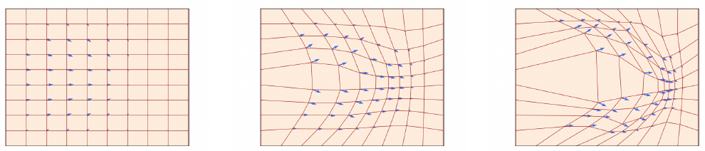

*Figure 1. A velocity field (blue arrows) moves the grid (red) over time. Source: [MIT 6.S184 lecture notes](https://diffusion.csail.mit.edu/2026/docs/lecture_notes.pdf), Figure 1.*

#### Simulating an ODE with Euler's Method

For a complicated vector field, we usually cannot find an explicit formula for the flow $\psi_t$. We can still approximate the trajectory by calculating small changes in position, one step at a time. This is called **numerical simulation**.

Euler's method divides the interval $[0,1]$ into $n$ steps of size $h=1/n$. In a flow model, we use a neural network $u_t^\theta(x)$ to predict the velocity. Here $\theta$ denotes the network's parameters. The Euler update is

$$
X_{t+h}=X_t+h\,u_t^\theta(X_t),\qquad t=0,h,\ldots,1-h.\tag{3}
$$

To take the first step, we give the network the starting point $X_0$ and time $0$. We multiply its predicted velocity by $h$ to calculate the change in position, then add that change to $X_0$. We repeat this calculation using the new position and time until we reach $t=1$.

Euler's method is an approximation to the continuous ODE. Smaller steps generally improve this approximation, and other numerical methods can give more accurate results.

### Sampling from a Trained Flow Model

Once we choose $X_0$, the ODE trajectory is deterministic. Starting from the same point gives the same result. To generate different samples, we choose $X_0$ randomly.

We sample $X_0$ from a distribution $p_{\mathrm{init}}$ that is easy to sample from. A common choice is the standard Gaussian $\mathcal N(0,I_d)$. We then want the trained velocity field to transform these initial samples into samples from $p_{\mathrm{data}}$:

$$
X_0\sim p_{\mathrm{init}},\qquad \frac{\mathrm dX_t}{\mathrm dt}=u_t^\theta(X_t)
\quad\Longrightarrow\quad X_1\sim p_{\mathrm{data}}.\tag{4}
$$

Equation (4) states our training goal. A randomly initialized network will generally not produce the desired final distribution. We need to train its parameters so that it does.

For now, suppose the network has been trained. To generate an image, we sample Gaussian noise and apply the Euler updates until $t=1$. The final vector $X_1$ contains the generated image's pixel values. Different starting noise gives different samples.

Figure 2 reproduces Algorithm 1 from the lecture notes, which shows this procedure. Each iteration updates the position $X_t$. The network parameters stay fixed during sampling. The number of steps $n$ determines the step size used to simulate the ODE.

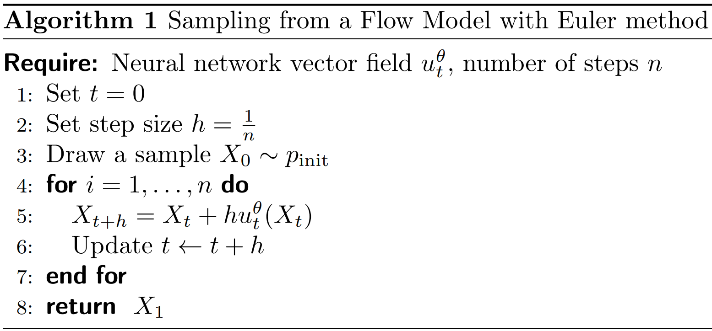

*Figure 2. Flow sampling with Euler updates. Source: [MIT 6.S184 lecture notes](https://diffusion.csail.mit.edu/2026/docs/lecture_notes.pdf), Algorithm 1.*

### Training Flow Models with Flow Matching

We now know how to sample from a trained flow model. How do we train its velocity field? To compare the network's output with a target, we need to know what velocity it should predict. Our dataset contains images, but it does not contain these target velocities.

Flow matching calculates target velocities from a **probability path**. I will first define this path, then derive the velocities, and finally explain the training loss.

#### Conditional and Marginal Probability Paths

We know the distributions we want at the endpoints: $p_0=p_{\mathrm{init}}$ and $p_1=p_{\mathrm{data}}$. But what distribution should our samples have at, say, $t=0.37$? The endpoints do not determine this. In flow matching, we choose a distribution $p_t$ for every intermediate time. These distributions, together with the endpoints, form the **marginal probability path** we want the model to follow.

Choosing these intermediate distributions directly is difficult: we only have examples from $p_{\mathrm{data}}$. A simpler approach is to start with one known image $z$ and describe distributions that gradually change from noise to that image. We can then combine these distributions across different images.

For a fixed image $z$, the **conditional probability path** specifies a distribution $p_t(\cdot\mid z)$ at each time. At an intermediate time, it describes the possible noisy versions of that image: $z$ is fixed, while the noisy sample $x$ varies. Its endpoints are

$$
p_0(\cdot\mid z)=p_{\mathrm{init}},\qquad p_1(\cdot\mid z)=\delta_z.\tag{5}
$$

Every conditional path starts with the same noise distribution. It ends at the Dirac distribution $\delta_z$, which always returns the image $z$ when sampled.

To obtain the marginal distribution at time $t$, we mix the conditional distributions for different images. Where densities exist, this is

$$
p_t(x)=\int p_t(x\mid z)\,p_{\mathrm{data}}(z)\,\mathrm dz.\tag{6}
$$

For a fixed $x$ and $t$, Equation (6) averages the conditional density values at $x$, weighted by how often each image occurs in the data. For example, with two equally likely images, $p_t$ is an equal mixture of their noisy-image distributions.

The problem is that we do not know the true data density $p_{\mathrm{data}}(z)$; we only have samples from it. For realistic image data, the integral over possible clean images is also computationally infeasible. Equation (6) therefore defines the marginal density $p_t(x)$, but does not give us a way to evaluate it directly.

The good news is that we can sample from this mixture without evaluating its density: pick an image $z$ from the data distribution, then sample a noisy version of it at the chosen time:

$$
z\sim p_{\mathrm{data}},\quad x\sim p_t(\cdot\mid z)
\quad\Longrightarrow\quad x\sim p_t.\tag{7}
$$

In practice, we use images from our dataset as the samples from $p_{\mathrm{data}}$. Repeat this with different images. The distribution of the resulting noisy samples is the **marginal distribution** $p_t$. At $t=0$, we get noise regardless of which image we picked. At $t=1$, we get the selected image itself, so sampling images from $p_{\mathrm{data}}$ gives the required final distribution.

We have reduced the problem to choosing a conditional path for one known image. Applying that choice to each image gives us the marginal path and a way to sample from it at any time. Next, we choose Gaussian conditional distributions. Later, we find velocities that make the model follow the resulting path.

#### Gaussian Probability Paths and Linear Schedules

The **Gaussian conditional probability path** chooses a Gaussian distribution at each intermediate time: for fixed $z$ and $t<1$, the noisy point has mean $\alpha_tz$ and covariance $\beta_t^2I_d$. At $t=1$, the distribution becomes $\delta_z$. The lecture notes identify this path as a common choice in state-of-the-art models.

Two functions of time, $\alpha_t$ and $\beta_t$, determine the amount of data and noise. These functions are called **schedules**. The data coefficient $\alpha_t$ increases from $0$ to $1$, while the noise coefficient $\beta_t$ decreases from $1$ to $0$. We take both functions to be continuously differentiable and monotone.

For a fixed clean example $z$, the conditional distribution and the formula for sampling from it are

$$
p_t(\cdot\mid z)=\mathcal N(\alpha_t z,\beta_t^2 I_d),\qquad
x_t=\alpha_t z+\beta_t\epsilon,\quad \epsilon\sim\mathcal N(0,I_d).\tag{8}
$$

Equation (8) gives both a distribution and a way to sample from it. With $z$ and $t$ fixed, draw $\epsilon\sim\mathcal N(0,I_d)$, multiply it by $\beta_t$, and add $\alpha_tz$. Multiplying the noise by $\beta_t$ gives variance $\beta_t^2$ in each coordinate, and adding $\alpha_tz$ sets the mean. Here $I_d$ is the identity matrix; the Gaussian noise coordinates are independent.

Only the conditional distribution is Gaussian. If we also sample $z$, the marginal distribution is a mixture of these Gaussians and is generally not Gaussian.

At $t=0$, $\alpha_0=0$ and $\beta_0=1$, so $x_0=\epsilon$ is pure noise. At $t=1$, $\alpha_1=1$ and $\beta_1=0$, so $x_1=z$ is the clean image. If we also sample a different $z$ each time, the resulting points follow the marginal distribution $p_t$, as described in Equation (7).

Figure 3 shows this process for digit images. Each digit occupies the same position in the five grids. Reading from left to right, the amount of noise decreases and the digit becomes visible. These examples were made directly from known images and noise. They show the probability path that we want the model to learn.

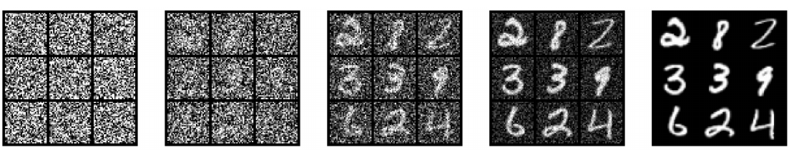

*Figure 3. Digit images along a Gaussian conditional path from noise to data. Source: [MIT 6.S184 lecture notes](https://diffusion.csail.mit.edu/2026/docs/lecture_notes.pdf), Figure 4.*

A simple choice of schedules is $\alpha_t=t$ and $\beta_t=1-t$. This gives $x_t=tz+(1-t)\epsilon$, which moves along a straight line from $\epsilon$ to $z$. This is called the **linear**, or Gaussian **CondOT**, probability path. We can choose other schedules as long as they are monotone, continuously differentiable, and satisfy the same endpoint conditions. In practice, linear schedules are a standard choice for state-of-the-art flow models.

Figure 4 shows how the conditional and marginal probability paths differ, using the linear schedules in two dimensions. Each panel shows a distribution of points at one time; brighter regions contain more samples. Time increases from left to right.

**The top row shows a Gaussian conditional path $p_t(\cdot\mid z)$.** Fix one clean point $z$, marked by the red star. To produce samples for a column at time $t$, repeatedly draw Gaussian noise $\epsilon$ and calculate $x_t=tz+(1-t)\epsilon$, keeping the same $z$. By Equation (8), these points follow $\mathcal N(tz,(1-t)^2I_2)$. As time increases, the mean moves toward $z$ and the variance decreases, until all samples reach that one point.

**The bottom row shows the marginal path $p_t$.** Use the same formula, but now draw a new clean point $z$ from the checkerboard data distribution for each sample, along with independent noise $\epsilon$. This is the sampling procedure in Equation (7). Each possible $z$ contributes its own Gaussian conditional distribution; combining them gives the mixture in Equation (6). We obtain samples from that mixture without evaluating its density. At $t=0$, every conditional distribution is the same standard Gaussian, so both rows start alike. At $t=1$, each sample equals its chosen $z$: the top row ends at one point, while the bottom row reproduces the checkerboard distribution.

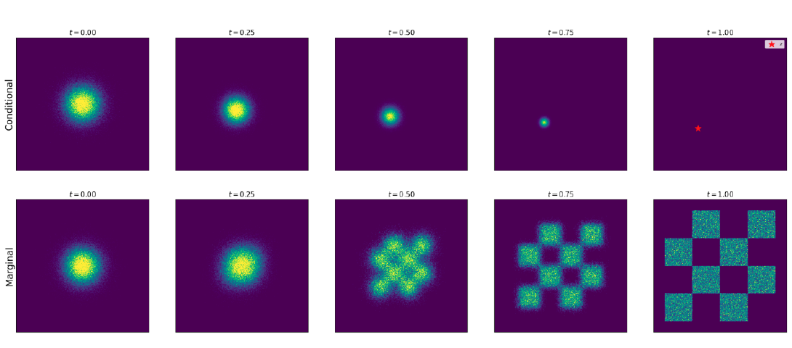

*Figure 4. Gaussian conditional paths converge to one fixed endpoint (top); their mixture produces the data distribution (bottom). Source: [MIT 6.S184 lecture notes](https://diffusion.csail.mit.edu/2026/docs/lecture_notes.pdf), Figure 5.*

We want samples from our trained flow model to have the distributions shown in the bottom row of Figure 4. Each column tells us how the samples should be distributed at that time, but it does not tell us where a particular point in one column moves in the next. For example, the final distribution tells us how likely a sample is to land in each checkerboard region. It does not tell us which region a particular starting noise sample will reach.

To determine that, we need a velocity field. Starting from one noise sample, we follow the field to calculate its position over time and its final location. Our next task is to find a field whose moving samples have the chosen distribution $p_t$ at every time.

#### Conditional and Marginal Velocity Fields

A **conditional velocity field** $u_t^{\mathrm{target}}(x\mid z)$ is a function of position $x$, time $t$, and a fixed clean example $z$. Its output is a velocity vector. To be valid for our conditional path, its ODE must produce the distribution $p_t(\cdot\mid z)$ at every time when initialized from $p_{\mathrm{init}}$:

$$
X_0\sim p_{\mathrm{init}},\qquad
\frac{\mathrm dX_t}{\mathrm dt}=u_t^{\mathrm{target}}(X_t\mid z)
\quad\Longrightarrow\quad X_t\sim p_t(\cdot\mid z).\tag{9}
$$

This is a requirement on the whole distribution of ODE samples. Simply reaching $z$ at the end is not enough: the samples must also have the chosen distributions at intermediate times. We use the superscript “target” for this field to distinguish it from the network $u_t^\theta$ that we will train.

For the Gaussian path, we can construct such a field directly.

For a fixed pair $(z,\epsilon)$, Equation (8) gives a trajectory $x_t=\alpha_tz+\beta_t\epsilon$. To calculate its velocity, we differentiate with respect to time while keeping $z$ and $\epsilon$ fixed:

$$
u_t^{\mathrm{target}}(x_t\mid z)=\dot\alpha_tz+\dot\beta_t\epsilon.\tag{10}
$$

The dot notation means a derivative with respect to time. For example, $\dot\alpha_t=\mathrm d\alpha_t/\mathrm dt$.

Equation (10) uses the initial noise $\epsilon$. We can also write the velocity in terms of the current position $x$. Rearranging $x=\alpha_tz+\beta_t\epsilon$ gives $\epsilon=(x-\alpha_tz)/\beta_t$ when $\beta_t>0$. Substituting this into Equation (10) gives

$$
u_t^{\mathrm{target}}(x\mid z)
=\dot\alpha_tz+\frac{\dot\beta_t}{\beta_t}(x-\alpha_tz).\tag{11}
$$

For the linear CondOT schedules, $\dot\alpha_t=1$ and $\dot\beta_t=-1$. Equations (10) and (11) then become

$$
u_t^{\mathrm{target}}(x_t\mid z)=z-\epsilon
\quad\text{or, for }t<1,\quad
u_t^{\mathrm{target}}(x\mid z)=\frac{z-x}{1-t}.\tag{12}
$$

The first expression in Equation (12) gives the constant velocity $z-\epsilon$. Starting at $\epsilon$ and moving with this velocity for one unit of time takes us to $z$. We can calculate this velocity directly from the clean example and the noise used to construct $x_t$. Later, we will see how this simple calculation lets us train the model.

The second expression gives the same velocity using the current position $x$ and time $t$. It divides by $1-t$, so it is defined only before the endpoint $t=1$.

We now know how to move noise toward one specified clean example $z$. But this conditional velocity field requires us to supply $z$. During generation, the clean image is what we want to produce, so we cannot supply it in advance.

We need a velocity field that uses only the current position $x$ and time $t$. Starting from $p_{\mathrm{init}}$, its ODE should produce the marginal distribution $p_t$ at every time, ending at the whole data distribution. We call such a field a **marginal velocity field**.

Earlier, we combined conditional distributions to obtain the marginal probability path. We can also construct a marginal velocity field by averaging conditional velocities. The question is how to weight them at a particular $x$ and $t$.

To determine these weights, return to the sampling procedure in Equation (7): draw a clean image $z$, then a noisy point from $p_t(\cdot\mid z)$. If we observe only the resulting point $x$, several clean images could explain it. Each gives a conditional velocity $u_t^{\mathrm{target}}(x\mid z)$ at that same position and time. We give more weight to the velocities of images that are more likely given this observation.

These weights come from the **posterior distribution** of the clean image $Z$ given $X_t=x$, written $p_t(z\mid x)$. It describes how likely each clean image is after observing the noisy point at time $t$. Here the conditioning is reversed: $p_t(x\mid z)$ describes noisy points given a clean image, while $p_t(z\mid x)$ describes clean images given a noisy point. Where densities exist, Bayes' rule gives

$$
p_t(z\mid x)=\frac{p_t(x\mid z)\,p_{\mathrm{data}}(z)}{p_t(x)}.\tag{13}
$$

The numerator combines the likelihood of observing $x$ from $z$ with the prior density of $z$. The denominator normalizes the posterior. We use these posterior weights to define the marginal velocity vector field:

$$
\begin{aligned}
u_t^{\mathrm{target}}(x)
&=\int u_t^{\mathrm{target}}(x\mid z)\,p_t(z\mid x)\,\mathrm dz\\
&=\mathbb E\!\left[u_t^{\mathrm{target}}(x\mid Z)\mid X_t=x\right].
\end{aligned}\tag{14}
$$

In Equation (14), we keep $x$ and $t$ fixed. For each possible clean example $z$, we calculate its conditional velocity at that same point and time. The integral averages these vectors, giving more weight to examples that are more likely under the posterior. The second line writes the same average as a conditional expectation.

Equation (6) averages conditional distributions using $p_{\mathrm{data}}(z)$, while Equation (14) averages conditional velocities using the posterior $p_t(z\mid x)$. The weights differ because Equation (6) describes samples from all clean images, weighted by how often each image is selected. Equation (14) gives a velocity for a specific noisy point $x$ at time $t$. We therefore also consider how likely each image is to produce that point. Bayes' rule in Equation (13) combines this likelihood with the image's frequency to give the posterior weights.

For example, suppose our data consists of two equally common images. They have equal mixture weights in Equation (6). If one is nine times more likely to produce the observed $x$, Equation (14) gives its conditional velocity 90% of the weight and the other velocity 10%.

The lecture notes show that simulating this marginal velocity field produces the marginal probability path $p_t$. The proof uses the **continuity equation**, which describes how a distribution changes as its points move. We will use that result without going through the full proof.

We now have a mathematical definition of the target velocity, but evaluating the integral in Equation (14) is generally **intractable**: computationally infeasible for the large-scale image models considered here. It requires averaging over possible clean images, with posterior weights that depend on the current $x$ and $t$. Even replacing the data distribution with a finite dataset leaves a sum over the entire dataset for every training input. We therefore cannot use this direct calculation to supply the training targets. The next section explains how conditional flow matching lets us learn the marginal velocity without evaluating this integral.

#### Flow Matching and Conditional Flow Matching Losses

We want the network $u_t^\theta(x)$ to predict the marginal velocity $u_t^{\mathrm{target}}(x)$. The **flow matching loss** measures the expected squared error between them:

$$
\mathcal L_{\mathrm{FM}}(\theta)
=\mathbb E_{t\sim\mathrm{Unif}[0,1],\,x\sim p_t}
\left[\|u_t^\theta(x)-u_t^{\mathrm{target}}(x)\|^2\right].\tag{15}
$$

The expectation samples $t$ uniformly from $[0,1]$ and then samples $x$ from $p_t$. Its target depends only on the current point and time.

Sampling $t$ and $x$ is easy, but the target in this loss requires the intractable integral in Equation (14). We can instead use the conditional velocity, which we can calculate for a sampled clean example.

The **conditional flow matching (CFM) loss** uses the same network inputs, but compares its prediction with $u_t^{\mathrm{target}}(x_t\mid z)$ for a sampled clean example $z$. This target is easy to calculate. For the Gaussian path, we create $x_t$ from a known pair $(z,\epsilon)$ and calculate the conditional velocity using Equation (10). The resulting loss is

$$
\mathcal L_{\mathrm{CFM}}(\theta)
=\mathbb E_{t,\,z\sim p_{\mathrm{data}},\,\epsilon\sim\mathcal N(0,I_d)}
\left[\left\|u_t^\theta(\alpha_tz+\beta_t\epsilon)
-(\dot\alpha_tz+\dot\beta_t\epsilon)\right\|^2\right],
\qquad t\sim\mathrm{Unif}[0,1].\tag{16}
$$

We can calculate every term in Equation (16). We need one data example, one noise sample, a time, and the schedule derivatives. But we want the network to learn the marginal velocity. Why does training on a conditional velocity achieve that?

The network receives only $(x_t,t)$. We use $z$ and $\epsilon$ to calculate the target, but do not give them to the network as separate inputs. Several clean images can explain a given noisy point, each with a different conditional velocity. Under squared error, the best prediction at that point is the conditional mean of these velocities. Equation (14) tells us that this mean is exactly the marginal velocity we wanted.

This is the key result of flow matching: **we train against conditional velocities that we can calculate, and the squared-error objective makes the network learn their posterior average without us calculating that average.** For the linear path, each target is simply $z-\epsilon$. These easy targets let us learn the marginal velocity whose integral was intractable.

This illustrates a useful strategy in machine learning: replace an objective whose targets we cannot evaluate with a computable objective that has the same minimizers. Here, $\mathcal L_{\mathrm{CFM}}(\theta)=\mathcal L_{\mathrm{FM}}(\theta)+C$, where $C$ is independent of $\theta$. Therefore, any parameters $\theta^*$ that globally minimize CFM also globally minimize FM, and vice versa. There may be several such parameter choices; the two losses share the same set. The expected losses also have identical gradients at every value of $\theta$. In symbols, $\nabla_\theta\mathcal L_{\mathrm{CFM}}(\theta)=\nabla_\theta\mathcal L_{\mathrm{FM}}(\theta)$. Training with sampled conditional targets therefore gives unbiased gradient estimates for the marginal objective.

Having the same minimizers does not guarantee that a trained network predicts the marginal velocity exactly. The network needs enough capacity to learn this function, and optimization must reach the required parameters.

Even a network that predicts the marginal velocity perfectly can have a nonzero CFM loss. For the same noisy point and time, different clean images can give different conditional velocity targets. The correct marginal prediction is their posterior-weighted average, so it can differ from the individual target used to calculate the loss.

#### Flow Matching Training Algorithm

For the linear CondOT path, one training step is simple. Sample a clean image $z$, independent Gaussian noise $\epsilon$, and a uniform random time $t$. Calculate $x_t=tz+(1-t)\epsilon$, give $(x_t,t)$ to the network, and compare its output with $z-\epsilon$. Then update the network parameters by gradient descent.

Figure 5 reproduces Algorithm 3 from the lecture notes, which shows these steps. The formulas on the left use the linear schedule. The formulas on the right apply to a general conditional path.

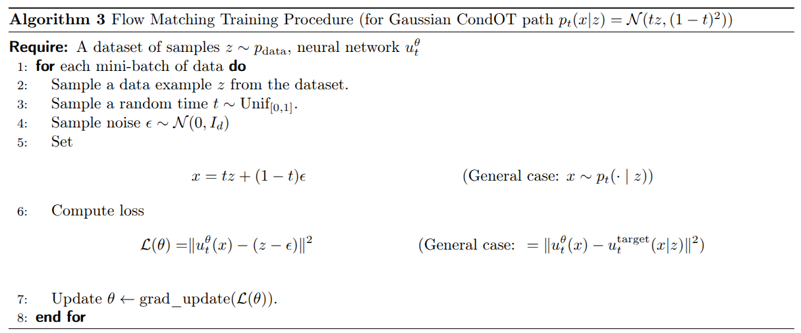

*Figure 5. Conditional flow matching training with linear schedules and the general conditional target. Source: [MIT 6.S184 lecture notes](https://diffusion.csail.mit.edu/2026/docs/lecture_notes.pdf), Algorithm 3.*

During training, we calculate each noisy point directly from data and noise. We do not need to simulate an ODE. After training, we generate samples with the procedure in Figure 2: start with noise and repeatedly update the position using the learned velocity field.

Figure 6 compares the chosen probability paths (left) with samples produced by ODE simulation (middle); point colors indicate time. The top row uses a conditional velocity field that takes every sample to the fixed image represented by the red star. The bottom row uses a learned marginal field that distributes samples across the blue data clusters. The similar distributions in the left and middle columns show what we want flow matching to achieve. The right column shows individual trajectories: straight toward the fixed endpoint in this conditional example, and generally curved toward different endpoints for the marginal ODE.

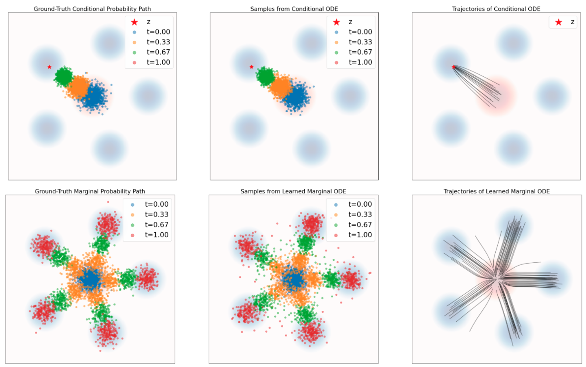

*Figure 6. Chosen probability paths (left), ODE samples (middle), and ODE trajectories (right), for conditional (top) and marginal (bottom) fields. Source: [MIT 6.S184 lecture notes](https://diffusion.csail.mit.edu/2026/docs/lecture_notes.pdf), Figure 6.*

## Diffusion Models

A flow model gives the same trajectory whenever we use the same initial point. A diffusion model also adds random noise during the trajectory. Two runs can therefore start at the same $X_0$ and reach different endpoints.

Our goal is still to start with samples from $p_{\mathrm{init}}$ and end with samples from $p_{\mathrm{data}}$. I will first explain how to describe and simulate the additional noise. Then I will explain how to train the model.

### Mathematical Foundations of Diffusion Models

#### Brownian Motion

A **Brownian motion** describes a point moving randomly over time. Its position at each time $t$ is a random variable $W_t$. This collection of random variables is called a **stochastic process**. One realization of the process gives one trajectory. Every trajectory starts at $W_0=0$ and is continuous, with no jumps.

Over a time interval of length $h$, the position changes by $W_{t+h}-W_t$. We call this change an **increment**. For Brownian motion, the increment is Gaussian, with mean zero and covariance $hI_d$. This means that each coordinate has variance $h$.

Increments over intervals that do not overlap are independent: knowing the change during one interval does not change the distribution of the change during another. To sample Brownian positions at times $0,h,2h,\ldots$, we therefore draw a fresh, independent Gaussian noise vector $\epsilon_t$ at each step and update the position:

$$
W_{t+h}-W_t\sim\mathcal N(0,hI_d),\qquad
W_{t+h}=W_t+\sqrt h\,\epsilon_t,\quad \epsilon_t\sim\mathcal N(0,I_d).\tag{17}
$$

Equation (17) uses $\sqrt h$ because scaling standard Gaussian noise by $\sqrt h$ gives variance $(\sqrt h)^2=h$ in each coordinate, as Brownian motion requires.

Consider one-dimensional Brownian motion from $t=0$ to $t=1$. One step of length $1$ gives a displacement with variance $1$. Alternatively, take ten steps of length $0.1$. Each displacement has variance $0.1$, and the final displacement is their sum. For independent random variables, the variance of their sum equals the sum of their variances, so the final variance is $10\times0.1=1$. Both methods therefore give the same variance at $t=1$ across repeated runs. Taking smaller steps gives us more intermediate positions without changing this endpoint variance.

Figure 7 shows several Brownian trajectories in one dimension. The horizontal axis is time. The vertical axis shows the current position, labeled $X_t$ in this illustration. All curves start at zero, but each uses different random increments. The plot extends to time 5; we use $[0,1]$ for generation.

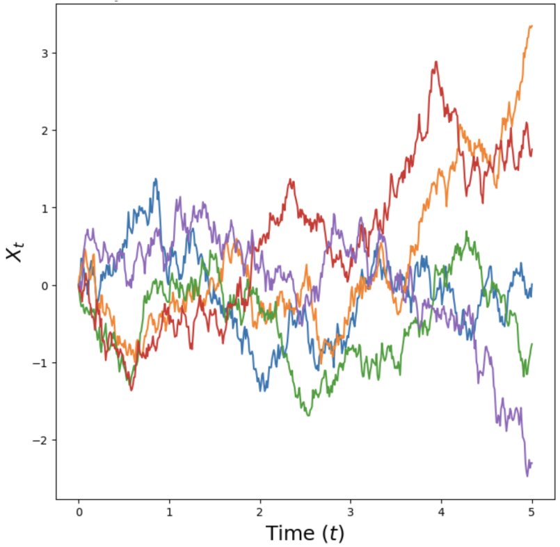

*Figure 7. One-dimensional Brownian trajectories. Each colored curve is a separate run starting at zero. Source: [MIT 6.S184 lecture notes](https://diffusion.csail.mit.edu/2026/docs/lecture_notes.pdf), Figure 2.*

#### Stochastic Differential Equations and Euler–Maruyama Simulation

Brownian motion by itself just adds noise. To generate data, we also need a vector field that moves the samples toward the data distribution. Combining the vector field with Brownian motion gives a **stochastic differential equation (SDE)**:

$$
\mathrm dX_t=f_t(X_t)\,\mathrm dt+\sigma_t\,\mathrm dW_t,\qquad \sigma_t\geq0.\tag{18}
$$

The **drift** $f_t(x)$ is the expected rate of change in position when the current position is $X_t=x$. Imagine starting many runs from this same position at time $t$, each with different Brownian noise. Over a short interval $h$, their average displacement is approximately $h f_t(x)$. This is the mean conditioned on $X_t=x$: $\mathbb E[X_{t+h}-X_t\mid X_t=x]\approx h f_t(x)$. The **diffusion coefficient** $\sigma_t\geq0$ controls the random part: its covariance over that interval is approximately $h\sigma_t^2I_d$.

I use $f_t$ for the SDE drift to distinguish it from the ODE velocity $u_t$. When Brownian noise is present, the individual trajectories are not differentiable. The drift describes their average movement, rather than the velocity of an individual trajectory.

The notation $\mathrm dW_t$ represents a Brownian increment. To simulate the SDE, we use time steps of size $h$. We approximate the drift contribution over a step by $h f_t^\theta(X_t)$ and sample the Brownian increment as $\sqrt h\,\epsilon_t$. This gives the **Euler–Maruyama** update:

$$
X_{t+h}=X_t+h\,f_t^\theta(X_t)+\sqrt h\,\sigma_t\epsilon_t,\qquad
\epsilon_t\sim\mathcal N(0,I_d).\tag{19}
$$

At each step, we evaluate the drift estimate at the current position and time. We multiply it by $h$ and add the result to $X_t$. We also add a new noise vector scaled by $\sqrt h\,\sigma_t$.

If $\sigma_t=0$, Equation (19) becomes the Euler update for an ODE. If we add noise, the trajectory also depends on the random draws made during simulation.

#### A Simple Example: Attraction and Noise

To see how drift and noise interact, consider a one-dimensional drift $f_t(x)=-\kappa x$, with a constant $\kappa>0$. It pulls positive positions down and negative positions up, toward zero. Adding constant diffusion gives the **Ornstein–Uhlenbeck process**:

$$
\mathrm dX_t=-\kappa X_t\,\mathrm dt+\sigma\,\mathrm dW_t.\tag{20}
$$

With $\sigma=0$, each trajectory smoothly approaches zero. With $\sigma>0$, noise keeps the trajectories fluctuating. Over a long time, their distribution approaches $\mathcal N(0,\sigma^2/(2\kappa))$. Stronger attraction makes this distribution narrower; stronger diffusion makes it wider.

Figure 8 keeps the attraction fixed and increases diffusion from left to right. Each curve shows position over time; the plots extend to time 20 to show the long-term behavior. The plot calls the attraction coefficient $\theta$; here we use $\kappa$ to distinguish it from network parameters. Notice that a stable distribution does not mean the individual trajectories stop moving.

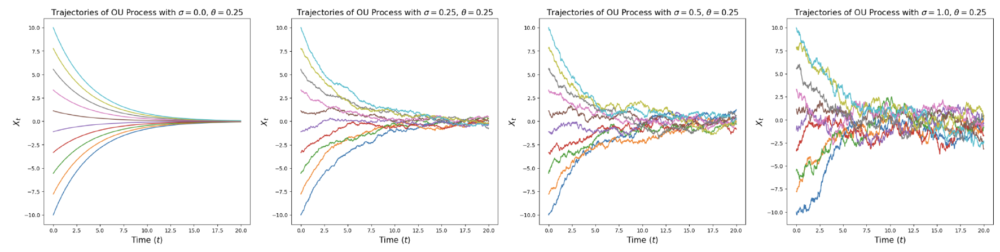

*Figure 8. Fixed attraction toward zero with increasing diffusion from left to right. Source: [MIT 6.S184 lecture notes](https://diffusion.csail.mit.edu/2026/docs/lecture_notes.pdf#page=11), Figure 3.*

### Sampling from a Trained Diffusion Model

Suppose we have a drift estimate $f_t^\theta$ and a chosen diffusion coefficient $\sigma_t$. The drift can be the direct output of a network, or we can calculate it from another prediction. In the training section, we will learn a score or noise predictor and use it to calculate the drift.

We sample $X_0\sim p_{\mathrm{init}}$, choose a step size $h=1/n$, and repeat Equation (19) until $t=1$. We return $X_1$ as the generated sample.

Figure 9 reproduces Algorithm 2 from the lecture notes, which shows this procedure. The image uses $u_t^\theta$ for the drift network, following the lecture notes. This is the same quantity I call $f_t^\theta$ here. The difference from flow sampling is the Gaussian draw inside the loop: we add new noise at every step.

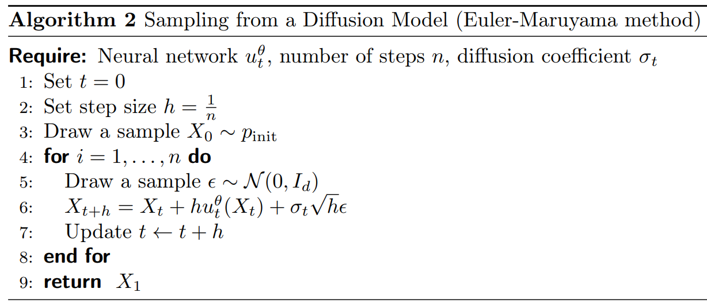

*Figure 9. Diffusion sampling with Euler–Maruyama updates. Source: [MIT 6.S184 lecture notes](https://diffusion.csail.mit.edu/2026/docs/lecture_notes.pdf), Algorithm 2.*

Training must give us a drift that produces the desired final distribution when we also add this noise. We can use the probability paths from flow matching to define this training problem.

### Training Diffusion Models with Score Matching

We already know how to train a velocity field whose ODE follows a chosen probability path $p_t$. If we add Brownian noise to that ODE without changing the drift, the noise generally changes the distributions of $X_t$.

To keep the same probability path, we need to adjust the drift. The adjustment uses a quantity called the **score function**.

#### Conditional and Marginal Score Functions

For a differentiable positive density $q(x)$, its **score function** is $\nabla_x\log q(x)$. It takes a point $x$ as input and returns a vector. Each coordinate is a partial derivative of log density with respect to the corresponding coordinate of $x$. The vector points in the direction where log density increases fastest.

For our probability paths, there are two score functions. The **conditional score** is $\nabla_x\log p_t(x\mid z)$: we fix $t$ and $z$ and differentiate with respect to $x$. The **marginal score** is $\nabla_x\log p_t(x)$: we fix $t$ and differentiate the log density of the full mixture. They describe different distributions, so they are generally different vectors at the same $x$.

Figure 10 shows a density and its score in two dimensions. Red regions in the left panel have higher density. The arrows in the right panel show the score at each location. They point in directions that locally increase log density. In our model, we use the score of $p_t$, so the score also changes with time.

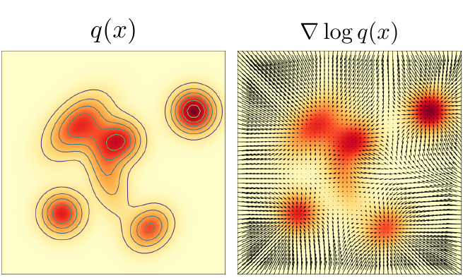

*Figure 10. A probability density (left) and its score vector field (right). Source: [MIT 6.S184 lecture notes](https://diffusion.csail.mit.edu/2026/docs/lecture_notes.pdf), Figure 8.*

To adjust the diffusion drift, we need the marginal score $\nabla_x\log p_t(x)$. For our data mixture, calculating it directly requires an intractable average over possible clean images. We faced a similar problem with the marginal velocity: the conditional velocity was easy to calculate, and its posterior average gave the marginal velocity. We will use the same approach for scores.

We chose a Gaussian conditional path in Equation (8), a common choice in practical models. This is useful because a Gaussian distribution has an explicit score formula. For a Gaussian with mean $\mu$ and positive-definite covariance matrix $\Sigma$,

$$
q=\mathcal N(\mu,\Sigma)
\quad\Longrightarrow\quad
\nabla_x\log q(x)=-\Sigma^{-1}(x-\mu).\tag{21}
$$

If $\Sigma=s^2I_d$, each coordinate has variance $s^2$, and the score simplifies to $-(x-\mu)/s^2$. Our conditional distribution has exactly this form: with $z$ and $t$ fixed, its mean is $\mu=\alpha_tz$ and its variance in each coordinate is $s^2=\beta_t^2$. Substituting these into the Gaussian score formula gives:

$$
\nabla_x\log p_t(x\mid z)
=-\frac{x-\alpha_tz}{\beta_t^2}
=-\frac{\epsilon}{\beta_t},\qquad \beta_t>0.\tag{22}
$$

Equation (22) is the **conditional score function for our Gaussian probability path**. Given a clean image $z$, a time $t$, and a noisy point $x$, it gives the score of $p_t(\cdot\mid z)$ at that point. When we create $x=\alpha_tz+\beta_t\epsilon$, we know the added noise, so $x-\alpha_tz=\beta_t\epsilon$ and the score simplifies to $-\epsilon/\beta_t$. We can therefore calculate this conditional score directly for each noisy training example.

During generation, we do not know the clean image $z$. We need the marginal score $\nabla_x\log p_t(x)$, which depends only on $x$ and $t$. As with the marginal velocity, it is the average of the conditional scores over possible clean images, weighted by the posterior distribution given $x$:

$$
\begin{aligned}
\nabla_x\log p_t(x)
&=\int \nabla_x\log p_t(x\mid z)\,p_t(z\mid x)\,\mathrm dz\\
&=\mathbb E\!\left[\nabla_x\log p_t(x\mid Z)\mid X_t=x\right].
\end{aligned}\tag{23}
$$

In Equation (23), $x$ and $t$ are fixed, and we integrate over possible clean examples $z$. The posterior density $p_t(z\mid x)$ from Equation (13) weights each conditional score, just as it weights each conditional velocity in Equation (14). The second line expresses the same average as a conditional expectation. This relation will let us train the network using conditional scores, even though we want it to predict the marginal score.

#### Converting Between Scores and Velocities for Gaussian Paths

To add Brownian noise while keeping our chosen probability path, we will need both the marginal velocity and the marginal score. For the Gaussian conditional path we chose, we can obtain the velocity from the score. This means a single score network can provide both quantities.

The calculation has two steps: use the score to estimate the clean image, then use that estimate to calculate the velocity.

**First, estimate the clean image.** Given a noisy point $x$ at time $t$, several clean images may have produced it. We average these images using the posterior weights $p_t(z\mid x)$. This gives the **denoiser**, $D_t(x)=\mathbb E[Z\mid X_t=x]$. It returns one estimated image by averaging the possible clean images pixel by pixel. The estimate can be blurry when several different images are plausible.

We can calculate this average from the score. Equation (22) gives the conditional score as $(\alpha_tz-x)/\beta_t^2$. To get the marginal score, Equation (23) averages this expression over $z$. Since $x$ and $t$ stay fixed, we replace $z$ with its average $D_t(x)$. This gives $\nabla_x\log p_t(x)=(\alpha_tD_t(x)-x)/\beta_t^2$. Rearranging gives the first line of Equation (24).

**Next, calculate the velocity from the estimated image.** The conditional velocity in Equation (11) is $\dot\alpha_tz+(\dot\beta_t/\beta_t)(x-\alpha_tz)$. To get the marginal velocity, we average over possible clean images using the same posterior weights, as in Equation (14). Because this expression is linear in $z$, we again replace $z$ with $D_t(x)$. This gives the second line below. For $\alpha_t,\beta_t>0$,

$$
\begin{aligned}
D_t(x)&=\frac{x+\beta_t^2\nabla_x\log p_t(x)}{\alpha_t},\\[6pt]
u_t^{\mathrm{target}}(x)&=\dot\alpha_tD_t(x)
+\frac{\dot\beta_t}{\beta_t}\bigl(x-\alpha_tD_t(x)\bigr).
\end{aligned}\tag{24}
$$

Given a score prediction at $(x,t)$, the first line gives a clean-image estimate and the second gives a velocity estimate. The schedules and their derivatives are known. We do not need to evaluate a posterior integral or train separate networks for the denoiser and velocity. At the endpoints, where $\alpha_t$ or $\beta_t$ is zero, these divisions require separate treatment.

We can combine these steps into one formula by substituting $D_t(x)$ from the first line into the second:

$$
u_t^{\mathrm{target}}(x)=a_t\nabla_x\log p_t(x)+b_t x.\tag{25}
$$

Here $a_t$ and $b_t$ are shorthand for the schedule coefficients:

$$
\begin{aligned}
a_t&=\beta_t^2\frac{\dot\alpha_t}{\alpha_t}-\beta_t\dot\beta_t,\\
b_t&=\frac{\dot\alpha_t}{\alpha_t}.
\end{aligned}\tag{26}
$$

To calculate the velocity, multiply the score by $a_t$ and add $b_tx$. Neither coefficient is learned. We use these formulas where $\alpha_t$ and $\beta_t$ are nonzero.

For the linear schedules $\alpha_t=t$ and $\beta_t=1-t$, the coefficients are $a_t=(1-t)/t$ and $b_t=1/t$. The velocity formula simplifies to $u_t^{\mathrm{target}}(x)=[(1-t)\nabla_x\log p_t(x)+x]/t$ for $0<t<1$. Multiply the score by $1-t$, add $x$, and divide by $t$.

**We can also calculate the score from the velocity.** Equation (25) can be rearranged whenever $a_t\ne0$. For the linear schedules, this gives $\nabla_x\log p_t(x)=[t\,u_t^{\mathrm{target}}(x)-x]/(1-t)$ for $0<t<1$. Multiply the velocity by $t$, subtract $x$, and divide by $1-t$.

A network trained with flow matching can therefore supply a score estimate too. For these intermediate times, we can use either a score network or a velocity network to calculate the velocity and score needed for the SDE below.

#### Constructing an SDE that Follows the Same Probability Path

We can now specify the drift adjustment. Suppose the ODE with velocity $u_t^{\mathrm{target}}$ follows the probability path $p_t$. For a chosen diffusion coefficient $\sigma_t$, consider this SDE:

$$
\mathrm dX_t=\left[u_t^{\mathrm{target}}(X_t)
+\frac{\sigma_t^2}{2}\nabla_x\log p_t(X_t)\right]\mathrm dt
+\sigma_t\,\mathrm dW_t,\qquad X_0\sim p_{\mathrm{init}}\tag{27}
$$

The SDE in Equation (27) has the same marginal distribution $p_t$ at every time as the original ODE. At any chosen time, samples from the ODE and SDE are distributed in the same way. The trajectories can still differ: from a given position, the ODE determines where a sample moves next, while the SDE also adds random noise. This result assumes exact velocity and score functions and an exact solution of the SDE.

The added Brownian noise spreads out probability mass. The added drift term $(\sigma_t^2/2)\nabla_x\log p_t(x)$ compensates for this change. Together, they leave the probability path unchanged. The lecture notes prove this using the **Fokker–Planck equation**.

Figure 11 shows an example. In the top row, the clean endpoint is fixed at the red star. In the bottom row, clean endpoints are sampled from the data distribution, shown as blue clusters. The left column shows samples drawn directly from the chosen probability paths. The middle column shows samples produced by SDE simulation. The similar distributions in these two columns show what Equation (27) achieves.

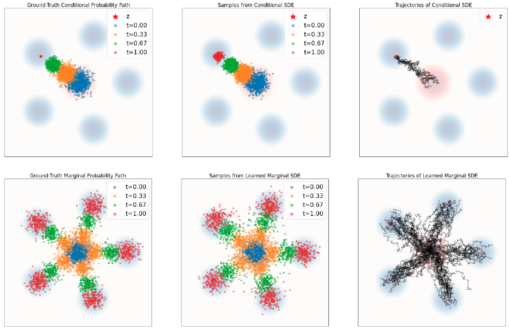

*Figure 11. Chosen probability paths (left), SDE samples (middle), and SDE trajectories (right), for conditional (top) and marginal (bottom) distributions. Source: [MIT 6.S184 lecture notes](https://diffusion.csail.mit.edu/2026/docs/lecture_notes.pdf), Figure 9.*

Compare the SDE trajectories in the right column of Figure 11 with the ODE trajectories in Figure 6 at the end of the flow section. The ODE trajectories are smooth and determined by the starting point. These SDE trajectories are irregular because new Brownian noise is added as they evolve; even runs from the same starting point can differ. Despite this difference in individual motion, the score correction lets the SDE follow the same distributions at each time as the ODE.

To use Equation (27) in our sampler, we set the drift to $f_t(x)=u_t^{\mathrm{target}}(x)+(\sigma_t^2/2)\nabla_x\log p_t(x)$. We then approximate the velocity and score with a trained model. Setting $\sigma_t=0$ gives the original flow ODE. With exact functions and continuous simulation, different choices of $\sigma_t$ can follow the same probability path. In practice, model errors and finite step sizes affect the results.

#### Denoising Score Matching

We still need to train a model to predict the marginal score. Let $s_t^\theta(x)$ be a score network. It takes a noisy point $x$ and time $t$ as inputs and returns a score estimate.

The **score matching loss** compares the predicted score with the true marginal score at points sampled from the probability path:

$$
\mathcal L_{\mathrm{SM}}(\theta)
=\mathbb E_{t\sim\mathrm{Unif}[0,1],\,x\sim p_t}
\left[\left\|s_t^\theta(x)-\nabla_x\log p_t(x)\right\|^2\right].\tag{28}
$$

We cannot evaluate this loss directly because its target is the unknown marginal score.

The **denoising score matching loss** instead compares the same network output with the conditional score $\nabla_x\log p_t(x\mid z)$ for the clean example used to construct $x$. The input to the network remains $(x,t)$; only the training target changes.

For the Gaussian path, sample $t\sim\mathrm{Unif}[0,1]$, $z\sim p_{\mathrm{data}}$, and independent $\epsilon\sim\mathcal N(0,I_d)$. Calculate $x_t=\alpha_tz+\beta_t\epsilon$. Equation (22) gives the conditional score target $-\epsilon/\beta_t$, so the denoising score matching loss becomes

$$
\mathcal L_{\mathrm{DSM}}(\theta)
=\mathbb E_{t,z,\epsilon}\left[\left\|s_t^\theta(\alpha_tz+\beta_t\epsilon)
+\frac{\epsilon}{\beta_t}\right\|^2\right].\tag{29}
$$

We know the noise that we added, so we can calculate the conditional score target.

The same argument used for conditional flow matching applies here. The network receives $(x_t,t)$. Under squared error, the best prediction is the conditional mean of the target scores. Equation (23) says that this mean is the marginal score.

When the expected losses are finite, the denoising score matching loss and the marginal score matching loss differ by a constant independent of $\theta$. Their expected gradients with respect to $\theta$ are therefore the same.

#### Noise Prediction and the Diffusion Training Algorithm

The target in Equation (29) divides by $\beta_t$. As $t$ approaches $1$, $\beta_t$ approaches zero, so the target can become very large. For linear schedules, the unweighted expected score loss can even be infinite. Excluding $t=1$ is not enough, because noise levels arbitrarily close to zero still cause this problem. We can keep the training noise level above a positive minimum or give less weight to errors near that endpoint.

A common choice is to train the network to predict the added noise. As we will see below, the usual noise-prediction loss also changes how much weight we give to errors at different times.

A **noise predictor** $\epsilon_t^\theta(x)$ takes a noisy point and time and estimates the Gaussian noise $\epsilon$ used to construct that point. Its training target is the noise vector itself.

We relate a noise prediction to a score prediction by $\epsilon_t^\theta(x)=-\beta_t s_t^\theta(x)$. This is a change in what the network output represents. The conditional score target $-\epsilon/\beta_t$ becomes the noise target $\epsilon$ after multiplying by $-\beta_t$. The noise-prediction loss is

$$
\mathcal L_{\mathrm{noise}}(\theta)
=\mathbb E_{t,z,\epsilon}\left[\left\|\epsilon_t^\theta(\alpha_tz+\beta_t\epsilon)-\epsilon\right\|^2\right].\tag{30}
$$

The network receives the noisy point and time, and predicts the noise that was added. It does not receive the actual noise sample as an input. As with the other squared-error losses, its optimal prediction is the conditional mean of the possible noise values given the input.

The score loss in Equation (29) and the noise loss in Equation (30) penalize prediction errors differently. To see why, convert the predicted noise to a score using $s_t^\theta(x)=-\epsilon_t^\theta(x)/\beta_t$. The score error is then $(\epsilon-\epsilon_t^\theta(x))/\beta_t$. Squaring it gives the squared noise error divided by $\beta_t^2$. Thus, expressing the score loss through a noise predictor introduces a weight of $1/\beta_t^2$ for each training example.

For example, the same squared noise error contributes 100 times more to the score loss when $\beta_t=0.1$ than when $\beta_t=1$. The noise loss in Equation (30) counts that error equally at both noise levels. Since $\beta_t$ decreases toward the data endpoint, the score loss gives greater weight to noise-prediction errors near that endpoint. Choosing Equation (30) therefore changes the training objective as well as the network's output. For either loss, the ideal noise prediction at each time is the conditional mean. A network with limited capacity may not predict equally well at every noise level, though. The loss weights then affect which errors training gives more importance to.

Figure 12 reproduces Algorithm 4 from the lecture notes, which shows the score matching training procedure. Steps 2–5 sample a clean example, a time, and noise, then calculate the noisy input. Step 6 gives two choices: train a score network against $-\epsilon/\beta_t$, or train a noise predictor against $\epsilon$. The expression on the right shows the conditional-score target for a general probability path.

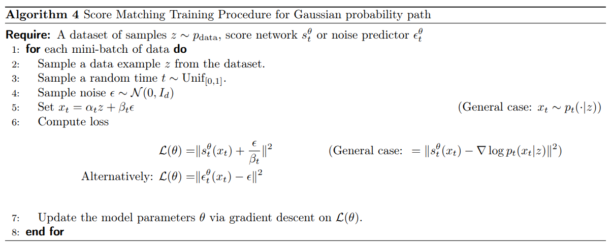

*Figure 12. Score matching training with conditional-score or noise-prediction targets. Source: [MIT 6.S184 lecture notes](https://diffusion.csail.mit.edu/2026/docs/lecture_notes.pdf), Algorithm 4.*

Before training, we choose whether the network's output vector represents a score estimate or a noise estimate, and use the corresponding loss throughout training. After calculating that loss, step 7 updates the network parameters by gradient descent.

As in flow matching, we calculate noisy points directly during training. We do not need to simulate the SDE.

#### Using the Trained Score Model for Sampling

If we trained a noise predictor, we first convert its output to a score estimate using $s_t^\theta(x)=-\epsilon_t^\theta(x)/\beta_t$, where $\beta_t>0$. For a Gaussian path, Equation (24) then converts this score estimate into a velocity estimate. We can therefore calculate both quantities from one trained model.

We choose a diffusion coefficient $\sigma_t$ and calculate the drift from Equation (27). Starting with Gaussian noise, we evaluate this drift at each step and apply the Euler–Maruyama update in Equation (19). Each step also adds a new Gaussian noise sample.

Some conversion formulas divide by $\alpha_t$ or $\beta_t$, which become zero at the endpoints. We must use suitable limiting expressions there, or avoid evaluating those formulas at the endpoints. A trained model and a finite number of simulation steps give an approximation to the ideal probability path.

Both flow and diffusion models start from a simple distribution and aim to produce samples from the data distribution. Flow models use deterministic ODE trajectories after the initial noise is chosen. Diffusion models add noise during SDE simulation as well. Flow matching trains a velocity predictor, while denoising score matching trains a score predictor. For Gaussian probability paths, we can convert between these predictions to construct either type of sampler.

## Guidance

So far, our models can generate samples from the data distribution. But we usually want to request something specific: a corgi, a handwritten digit, or an image matching a text description. We introduced this goal near the start of the post as sampling from $p_{\mathrm{data}}(\cdot\mid y)$, where $y$ is the requested class or prompt. Now we can explain how to train and sample from such a model.

I will first show how to give the prompt to the network. Then I will explain **classifier-free guidance (CFG)**, which strengthens the prompt's effect during sampling. I will use flow matching for the derivation and connect it to diffusion afterward.

### Training with a Prompt

We have already used “conditional” to mean conditioning on a known clean image $z$. Conditioning on a prompt $y$ is different. The distribution $p_t(\cdot\mid z)$ describes noisy versions of one specific image. The distribution $p_t(\cdot\mid y)$ describes noisy versions of the many images compatible with a prompt. During generation, we know the prompt but do not know the image we will produce.

Following the lecture notes, I will call conditioning on $y$ **guidance**. The simplest method, **vanilla guidance**, gives the network the prompt as an additional input. A velocity network now takes $(x,t,y)$ and returns one velocity vector $u_t^\theta(x\mid y)$.

Training uses image–prompt pairs $(z,y)$. We sample a pair, an independent time $t\sim\mathrm{Unif}[0,1]$, and independent noise $\epsilon\sim\mathcal N(0,I_d)$. As before, we construct $x_t=\alpha_tz+\beta_t\epsilon$ and calculate the conditional velocity target $\dot\alpha_tz+\dot\beta_t\epsilon$. The guided flow matching loss is

$$
\mathcal L_{\mathrm{guided\text{-}CFM}}(\theta)
=\mathbb E_{z,y,t,\epsilon}
\left[\left\|u_t^\theta(x_t\mid y)
-(\dot\alpha_tz+\dot\beta_t\epsilon)\right\|^2\right].\tag{31}
$$

Equation (31) changes the network's inputs, while retaining the target from Equation (16). For the linear schedules, that target is still $z-\epsilon$. The prompt affects which clean images the network considers plausible for a noisy input. Under squared error, the ideal prediction averages conditional velocities given the noisy point, time, **and prompt**. This gives the guided marginal velocity $u_t^{\mathrm{target}}(x\mid y)$.

At sampling time, we choose a prompt, start with Gaussian noise, and follow the learned velocity field while keeping that prompt fixed. With an exact field and exact simulation, the final sample follows $p_{\mathrm{data}}(\cdot\mid y)$.

### Why Strengthen the Prompt's Effect?

Vanilla guidance is enough in theory. In practice, the network may not learn the guided field accurately, and training captions may be incomplete or incorrect. Generated images can therefore match the requested prompt less well than we want.

Figure 13 illustrates this problem for the class “corgi dog.” The left group uses vanilla guidance; the right group uses stronger guidance and contains more consistently recognizable corgis. We want to understand how to strengthen conditioning without retraining a model for every desired strength.

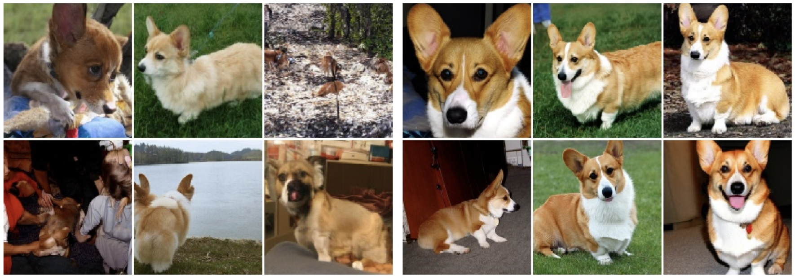

*Figure 13. Corgi-class generation with vanilla guidance (left) and stronger guidance at scale $w=4$ (right). Source: [MIT 6.S184 lecture notes](https://diffusion.csail.mit.edu/2026/docs/lecture_notes.pdf#page=35), Figure 11, reproduced there from reference [18].*

### Classifier Guidance: Separating the Prompt's Contribution

To strengthen the prompt's effect, we first need to identify which part of the velocity it changes. The relationship between scores and velocities lets us do this for our Gaussian paths.

At a fixed time, $p_t(y\mid x)$ describes how likely a label or prompt is given the noisy point $x$. We want to relate the density with a prompt, $p_t(x\mid y)$, to the density without one, $p_t(x)$. Bayes' rule gives the first line below. Taking its logarithm and differentiating with respect to $x$ gives the relation between their scores in the second line:

$$
\begin{aligned}
p_t(x\mid y)&=\frac{p_t(x)\,p_t(y\mid x)}{p(y)},\\
\nabla_x\log p_t(x\mid y)
&=\nabla_x\log p_t(x)+\nabla_x\log p_t(y\mid x).
\end{aligned}\tag{32}
$$

The prior $p(y)$ disappears from the derivative because it does not depend on $x$. The guided score is therefore the unguided score plus a gradient that increases the likelihood of the requested prompt. For a class label, we could calculate that extra gradient using a classifier trained to recognize labels from noisy images at each time $t$.

Equation (32) tells us how the prompt changes the score. Our flow sampler needs a velocity, so we now need to work out how that score change affects the velocity.

Recall the score-to-velocity formula in Equation (25), with the schedule coefficients $a_t$ and $b_t$ defined in Equation (26). Applying it with and without the prompt gives

$$
\begin{aligned}
u_t^{\mathrm{target}}(x\mid y)&=a_t\nabla_x\log p_t(x\mid y)+b_tx,\\
u_t^{\mathrm{target}}(x)&=a_t\nabla_x\log p_t(x)+b_tx.
\end{aligned}\tag{33}
$$

We are comparing the velocities at the same point $x$ and time $t$, using the same schedules. The coefficients are therefore identical in both lines; only the score changes when we supply the prompt.

Now subtract the unguided velocity from the guided velocity in Equation (33). The identical $b_tx$ terms cancel. The remaining difference is $a_t$ times the score difference, which Equation (32) identifies as $\nabla_x\log p_t(y\mid x)$:

$$
\begin{aligned}
u_t^{\mathrm{target}}(x\mid y)-u_t^{\mathrm{target}}(x)
&=a_t\left[\nabla_x\log p_t(x\mid y)-\nabla_x\log p_t(x)\right]\\
&=a_t\nabla_x\log p_t(y\mid x).
\end{aligned}\tag{34}
$$

Equation (34) gives exactly the velocity correction caused by the prompt. Adding this correction once to the unguided velocity gives ordinary guided generation. **Classifier guidance** strengthens its effect by multiplying it by a **guidance scale** $w$ before adding it:

$$
\widetilde u_t(x\mid y)
=u_t^{\mathrm{target}}(x)
+w a_t\nabla_x\log p_t(y\mid x).\tag{35}
$$

The tilde denotes the velocity we use for sampling after this modification. With $w=1$, we add the correction once and recover the ordinary guided velocity. With $w=2$, we add twice that correction. We are increasing the change caused by the prompt while keeping the unguided contribution unchanged.

This requires an additional classifier that works on noisy inputs and supplies a gradient with respect to $x$. Learning $p_t(y\mid x)$ is especially difficult when $y$ is an unrestricted text prompt. Classifier-free guidance obtains the correction another way.

### Classifier-Free Guidance: Use the Difference Between Predictions

Equation (34) expresses the classifier correction as the guided velocity minus the unguided velocity. Substituting this difference into Equation (35) gives

$$
\begin{aligned}
\widetilde u_t(x\mid y)
&=u_t^{\mathrm{target}}(x)
+w\left[u_t^{\mathrm{target}}(x\mid y)-u_t^{\mathrm{target}}(x)\right]\\
&=(1-w)u_t^{\mathrm{target}}(x)+w u_t^{\mathrm{target}}(x\mid y).
\end{aligned}\tag{36}
$$

**We can strengthen conditioning using only guided and unguided velocity predictions, without training a classifier.** Both predictions must be evaluated at the same noisy point $x$ and time $t$. Their difference tells us how the requested prompt changes the velocity there.

For a simple one-dimensional example, suppose the unguided velocity is $2$ and the guided velocity is $3$. With $w=4$, Equation (36) gives $2+4(3-2)=6$. We amplify the change caused by the prompt. We do not multiply the entire guided velocity by four.

Figure 14 compares the two methods. The top row calculates the prompt-dependent correction from a classifier gradient. The bottom row calculates it from the difference between guided and unguided velocities. The right panels scale up that correction, producing the red velocity vector. For exact fields under our Gaussian construction, the methods give the same result.

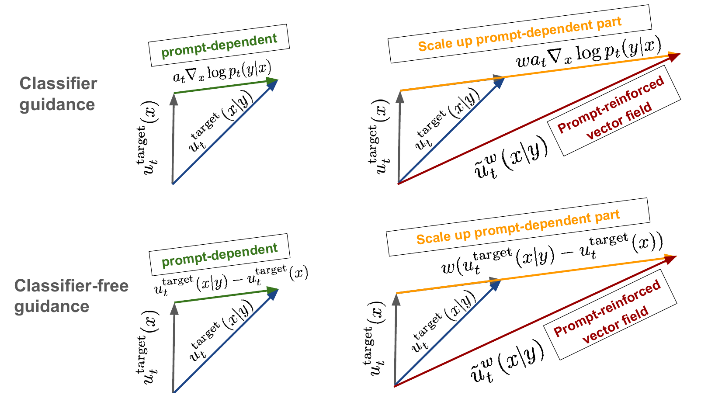

*Figure 14. Classifier guidance (top) and classifier-free guidance (bottom) obtain the prompt-dependent correction in different ways. Source: [MIT 6.S184 lecture notes](https://diffusion.csail.mit.edu/2026/docs/lecture_notes.pdf#page=36), Figure 12.*

The linear combination in Equation (36) can also be used with other probability paths. The Gaussian assumption was needed for the derivation through classifier gradients.

### Training One Network with and without Prompts

We need a guided prediction and an unguided prediction, but one network can learn both. We introduce a special **null prompt** $\varnothing$, which tells the network that no prompt information is available. The same network predicts $u_t^\theta(x\mid y)$ with the real prompt and $u_t^\theta(x\mid\varnothing)$ with the null prompt. It returns one velocity vector per evaluation.

To train the network to generate without a prompt, we randomly drop the prompt during training. For each image–prompt pair, independently replace $y$ with $\varnothing$ with probability $\eta$, where $0<\eta<1$. Call the resulting prompt $\widehat y$. We keep the same clean image, noisy input, and conditional velocity target. The training loss becomes

$$
\mathcal L_{\mathrm{CFG\text{-}CFM}}(\theta)
=\mathbb E_{z,y,t,\epsilon,\widehat y}
\left[\left\|u_t^\theta(x_t\mid\widehat y)
-(\dot\alpha_tz+\dot\beta_t\epsilon)\right\|^2\right].\tag{37}
$$

As in conditional flow matching, squared error is minimized by predicting the average target velocity given the network inputs. With a prompt, those inputs are $(x_t,t,y)$, so the average also depends on $y$. Without a prompt, the network only has $(x_t,t)$, and the training examples still come from the whole dataset. It therefore learns the unguided mean velocity.

Figure 15 shows the procedure. Steps 2–5 sample the image–prompt pair, time, and noise, then construct the noisy input. Step 6 sometimes drops the prompt. Steps 7–8 calculate the conditional flow matching loss and update the shared network parameters. The screenshot calls the dropout probability $p$; we call it $\eta$.

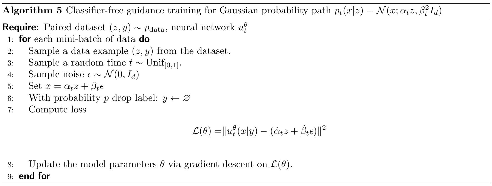

*Figure 15. Training a shared velocity network with real and null prompts. Source: [MIT 6.S184 lecture notes](https://diffusion.csail.mit.edu/2026/docs/lecture_notes.pdf#page=38), Algorithm 5.*

The dropout probability $\eta$ controls how often the network trains without a prompt. The guidance scale $w$ controls how its predictions are combined during sampling. We can change $w$ after training.

### Sampling and Choosing the Guidance Scale

Choose a prompt $y$ and a scale $w$, then start with $X_0\sim p_{\mathrm{init}}$. At each step, evaluate the network twice at the current position and time: once with $y$, once with $\varnothing$. Combine the predictions and take an Euler step:

$$
\begin{aligned}
\widetilde u_t^\theta(X_t\mid y)
&=(1-w)u_t^\theta(X_t\mid\varnothing)+w u_t^\theta(X_t\mid y),\\
X_{t+h}&=X_t+h\,\widetilde u_t^\theta(X_t\mid y).
\end{aligned}\tag{38}
$$

The requested prompt stays fixed as the point moves. Random prompt dropout is only used during training. We can batch the two evaluations. At $w=0$, we only need the unguided prediction; at $w=1$, we only need the guided prediction.

| Guidance scale | Velocity used for sampling |
|---|---|
| $w=0$ | Unguided prediction; the prompt has no effect. |
| $w=1$ | Ordinary guided prediction, as in vanilla guidance. |
| $w>1$ | Guided prediction with an amplified guided-minus-unguided difference. |

For $w>1$, the coefficient $1-w$ is negative. Equation (38) therefore extrapolates beyond the guided prediction rather than averaging the predictions with positive weights.

Figure 16 compares digit samples at $w=1$, $2$, and $4$. The rows of requested digits become more consistent with their labels as guidance increases in this example. Some ambiguous handwritten shapes in the left panel become clearer in the middle and right panels.

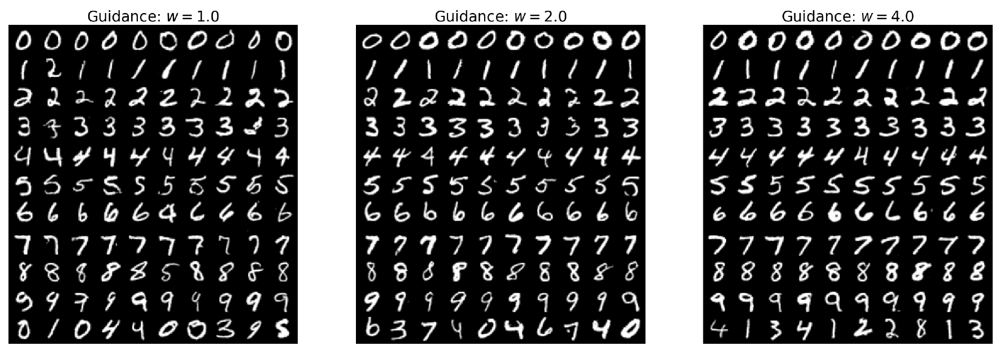

*Figure 16. Digit generation with guidance scales $w=1$ (left), $w=2$ (middle), and $w=4$ (right). Source: [MIT 6.S184 lecture notes](https://diffusion.csail.mit.edu/2026/docs/lecture_notes.pdf#page=39), Figure 13.*

Stronger guidance changes the velocity field, so it also changes the sampling distribution. Even with an exact model, $w>1$ does not guarantee samples from the original $p_{\mathrm{data}}(\cdot\mid y)$. In practice, stronger guidance often makes generated images match the prompt more closely. But increasing $w$ does not always improve the result.

### Using Guidance with Diffusion Models

The same approach applies when the network predicts a score or noise. Train with real and null prompts using the corresponding target from the diffusion training section. For a score network, combine its predictions as

$$
\widetilde s_t^\theta(x\mid y)
=(1-w)s_t^\theta(x\mid\varnothing)+w s_t^\theta(x\mid y).\tag{39}
$$

A noise predictor can use the same combination before conversion to a score, because the factor $-1/\beta_t$ is the same for both predictions at a given time. For Gaussian paths, Equation (24) then converts the combined score into a velocity estimate. Equation (33) shows why this agrees with combining the velocities directly: the coefficient of the shared $b_tx$ term remains $(1-w)+w=1$.

We use the resulting velocity and score to construct the SDE drift, just as in Equation (27):

$$
\widetilde f_t^\theta(x\mid y)
=\widetilde u_t^\theta(x\mid y)
+\frac{\sigma_t^2}{2}\widetilde s_t^\theta(x\mid y).\tag{40}
$$

Substitute this drift into the Euler–Maruyama update in Equation (19), with fresh Gaussian noise at each step. Setting $\sigma_t=0$ gives the guided flow sampler. At $w=1$, exact velocity and score functions give the probability path for the requested prompt. At $w>1$, we strengthen the prompt's effect by changing the velocity and score. The resulting SDE is therefore no longer guaranteed to sample from the original conditional data distribution.

The practical result is that one network can learn to generate with and without a prompt. During sampling, CFG compares those predictions at the current noisy point and scales the difference. This gives us a way to control the strength of conditioning for either flow or diffusion sampling.

## Conclusion

We have learned how flow and diffusion models work, how to train them, and how to generate samples with them. We also understand why their training and sampling algorithms take these forms. For Gaussian conditional probability paths, flow matching and diffusion are closely connected: we can convert between velocities and scores, and construct ODE and SDE samplers that follow the same distributions. Guidance lets us use these models to generate samples that match a requested condition. These ideas also apply beyond images and text. [AlphaFold 3](https://www.nature.com/articles/s41586-024-07487-w) uses diffusion to predict the three-dimensional structures of proteins and other interacting biomolecules. [MatterGen](https://doi.org/10.1038/s41586-025-08628-5) uses diffusion to propose crystal structures for new inorganic materials. [Voicebox](https://arxiv.org/abs/2306.15687) uses flow matching to generate and edit speech. Each application needs a suitable way to represent its data and a network designed for the task, but the ideas we learned here give us a starting point for building models for our own data. That is what I wanted from studying this subject: to understand why the algorithms work and how to use that understanding beyond the models I already knew.