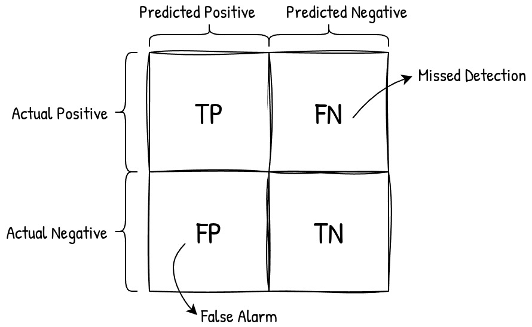
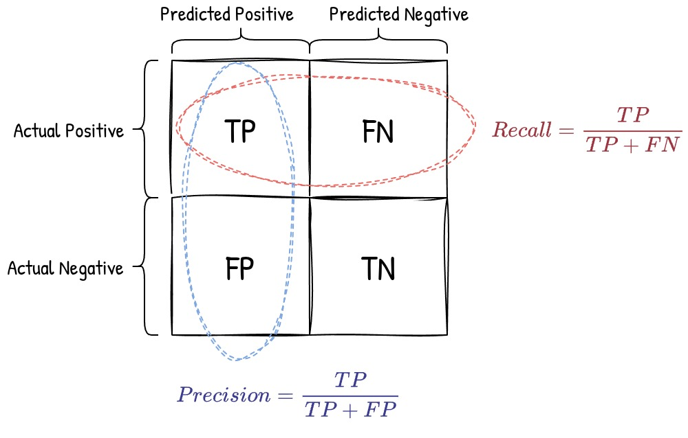

+++
date = '2026-06-05T14:46:42+03:30'
draft = false
title = 'Understanding Precision and Recall'
description = 'Make sense of precision and recall in the context of a confusion matrix'
tags = ['machine-learning', 'data-science', 'statistics', 'classification', 'model-evaluation']
+++

## Introduction

When I first learned about precision and recall, I found them confusing — but later realized these metrics are actually very intuitive. They just need the right context to click. The best way to think about them is through the confusion matrix. Once you understand the confusion matrix, precision and recall become natural and easy to reason about.

## Confusion Matrix

The figure below shows a confusion matrix for a binary classification task:

A few things to keep in mind before we go further:

- There are two classes in the dataset: Positive and Negative.
- Each **row** represents actual samples from one of these classes.
- The model made predictions about each sample and assigned a label (Positive or Negative) to it.
- Each **column** represents the model's predictions for a particular class.

In short: rows are about the actual data, columns are about predictions. When the model predicts a label for a sample, one of four outcomes can occur:

- The sample actually belonged to the **Positive** class *and* the model correctly predicted **Positive** → **True Positive (TP)**
- The sample actually belonged to the **Positive** class *but* the model incorrectly predicted **Negative** → **False Negative (FN)**
- The sample actually belonged to the **Negative** class *but* the model incorrectly predicted **Positive** → **False Positive (FP)**
- The sample actually belonged to the **Negative** class *and* the model correctly predicted **Negative** → **True Negative (TN)**

The model can make two types of errors:

- **FN — Missed detection:** The model fails to predict Positive when the sample actually belongs to the Positive class.
- **FP — False alarm:** The model predicts Positive when the sample actually belongs to the Negative class.

## Precision & Recall

As we saw, the model can make two types of mistakes: false alarms and missed detections. We need a way to evaluate classification models in terms of each error type. **Precision** quantifies the false alarm error — a model with high precision has fewer false alarms. **Recall** quantifies the missed detection error — a model with high recall misses fewer positive samples.

When we talk about **recall**, we focus on the row of all actual positive samples and compute the ratio of True Positives (TP) among them:

$$\text{Recall} = \frac{TP}{TP + FN}$$

When we talk about **precision**, we focus on the column of all positive *predictions* and compute the ratio of True Positives (TP) among them:

$$\text{Precision} = \frac{TP}{TP + FP}$$

Both metrics are about finding correctly predicted positive samples, but they look at different sets: recall looks at the actual dataset, while precision looks at the model's predictions.

## The Precision–Recall Tradeoff

In practice, precision and recall pull in opposite directions. A model that predicts Positive more aggressively will catch more true positives (higher recall), but will also produce more false alarms (lower precision). Conversely, a conservative model that only predicts Positive when very confident will have fewer false alarms (higher precision) but will miss more positive samples (lower recall).

Which metric matters more depends on the application. In medical diagnosis, missing a disease (low recall) can be life-threatening, so recall is prioritized. In spam filtering, incorrectly flagging a legitimate email (low precision) is more disruptive, so precision takes priority. The **F1 score** — the harmonic mean of precision and recall — is a common way to balance both when neither can be sacrificed.